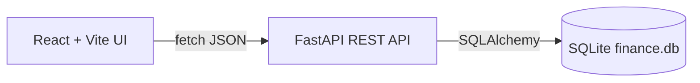

# Finance Tracker MVP

Build a local-only, three-tier personal Finance Tracker: a FastAPI + SQLite REST API with full CRUD and validation, plus a React (Vite) UI to add, edit, delete, and view income/expense transactions with a real-time balance summary.

A simple full-stack app for logging income/expenses with real-time balance. No auth, runs locally.

## Tech stack

- Backend: FastAPI, Uvicorn, SQLAlchemy, Pydantic v2 (Python 3.14)
- Frontend: React 18 + Vite, plain `fetch` for HTTP
- DB: SQLite file (`finance.db`), created automatically on startup

## Project layout

- `backend/` — FastAPI app
  - `main.py` — app, CORS, all four endpoints
  - `database.py` — SQLAlchemy engine + session
  - `models.py` — `Transaction` table
  - `schemas.py` — Pydantic request/response models + validation
  - `requirements.txt`
- `frontend/` — Vite React app (`src/App.jsx`, components, `api.js`)
- `README.md` — run instructions

## Database (`backend/models.py`)

`Transaction` table per spec:

- `id` (Integer, PK, autoincrement)
- `type` (String: "income" | "expense")
- `amount` (Numeric/Float)
- `category` (String)
- `description` (String, optional)
- `date` (DateTime, defaults to now if omitted)

## API endpoints (`backend/main.py`)

- `GET /api/transactions` — returns `{ transactions: [...], stats: { total_income, total_expense, balance } }`, computing balance in real time.
- `POST /api/transactions` — validate via Pydantic, store, return created row.
- `PUT /api/transactions/{id}` — update existing row; 404 if missing.
- `DELETE /api/transactions/{id}` — delete row; 404 if missing.

## Validation (`backend/schemas.py`)

- `amount` strictly positive (`gt=0`), enforced for POST and PUT.
- `type` restricted to `"income"`/`"expense"` (Literal/enum).
- `category` non-empty string; `description` optional; `date` optional (server defaults).
- Invalid input returns HTTP 422 automatically.

## Frontend (`frontend/src/`)

- `BalanceSummary` — shows total income, total expense, net balance (color-coded).
- `TransactionForm` — add/edit form (type, amount, category, description, date).
- `TransactionList` — table/list with Edit + Delete buttons.
- `api.js` — wrappers for the four endpoints (base URL `http://localhost:8000`).
- State refresh after every create/update/delete to keep balance live.
- Vite dev proxy (or CORS on backend) so the UI on `:5173` can call the API on `:8000`.

## Run instructions (README)

- Backend: `cd backend; python -m venv .venv; .venv\Scripts\activate; pip install -r requirements.txt; uvicorn main:app --reload`
- Frontend: `cd frontend; npm install; npm run dev`

## Implementation tasks

1. **backend-scaffold** — Create `backend/` with `database.py`, `models.py` (Transaction), `schemas.py` (validation), `main.py` (CRUD + stats), and `requirements.txt`.
2. **backend-endpoints** — Implement GET (with computed stats), POST, PUT, DELETE endpoints with strict positive-amount and type validation, plus CORS.
3. **frontend-scaffold** — Scaffold Vite React app in `frontend/` with `api.js` client and base layout.
4. **frontend-components** — Build BalanceSummary, TransactionForm (add/edit), and TransactionList (edit/delete) wired to the API with live refresh.
5. **readme-verify** — Add README run instructions and verify backend + frontend start and CRUD works locally.

## Notes / decisions

- "To-dos" in the request is interpreted as transaction records (create/edit/delete entries) since the whole spec is about transactions.
- Single SQLite file, no migrations tool — tables auto-created on startup for simplicity.
