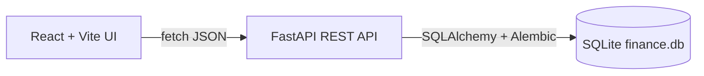

# Finance Tracker

A local-only personal finance app: FastAPI + SQLite REST API with full CRUD, filters, analytics, budgets, and recurring templates, plus a React (Vite) UI with charts, export, and dark mode.

No auth — runs locally on the developer's machine.

## Tech stack

- Backend: FastAPI, Uvicorn, SQLAlchemy, Pydantic v2, Alembic (Python 3.14)
- Frontend: React 18 + Vite, Recharts, plain `fetch`
- DB: SQLite file (`finance.db`), Alembic migrations on startup
- Quality: pytest, Vitest, ruff, Docker Compose, GitHub Actions

## Project layout

- `backend/` — FastAPI app
  - `main.py` — app, CORS, API routes
  - `repository.py` — SQL queries and aggregates
  - `constants.py` — predefined categories
  - `database.py` — engine, session, migration runner
  - `models.py` — Transaction, Budget, RecurringTransaction
  - `schemas.py` — Pydantic models + validation
  - `alembic/` — database migrations
  - `tests/` — pytest suite
- `frontend/` — Vite React app
  - `BalanceSummary`, `TransactionForm`, `TransactionList`, `FilterBar`, `ChartsPanel`, `BudgetPanel`, `RecurringPanel`
  - `api.js`, `validation.js`
- `docker-compose.yml` — one-command local stack
- `.github/workflows/ci.yml` — CI pipeline

## Database

### Transaction

- `id`, `type` ("income" | "expense"), `amount` (Numeric 12,2), `category`, `description` (optional), `date`

### Budget

- `id`, `category` (unique), `amount` — monthly limit per expense category

### RecurringTransaction

- `id`, `type`, `amount`, `category`, `description`, `frequency` ("weekly" | "monthly"), `next_date`

### Goal

- `id`, `name`, `target_amount`, `current_amount` (default 0), `target_date` (optional) — a savings target funded via contributions

## API endpoints

- `GET /api/health` — health check, reports whether the isolated E2E database is active
- `GET /api/categories` — income/expense category lists
- `GET /api/transactions` — paginated list + filtered stats; query: `type`, `category`, `from`, `to`, `search`, `page`, `page_size`
- `GET /api/transactions/export` — CSV download with same filters
- `GET /api/analytics` — stats, expense-by-category, monthly income/expense
- `GET /api/dashboard` — current-month KPIs + month-over-month expense comparison
- `POST/PUT/DELETE /api/transactions` — CRUD
- `GET/PUT/DELETE /api/budgets` — budget management
- `GET/POST/DELETE /api/recurring`, `POST /api/recurring/{id}/post` — recurring templates
- `GET/POST/PUT/DELETE /api/goals`, `POST /api/goals/{id}/contribute` — savings goals

Errors use a structured shape: `{ "error": { "code", "message", "details" } }`. OpenAPI operations are grouped with tags (transactions, analytics, budgets, recurring, goals, meta).

## Validation

- `amount` strictly positive, stored as Decimal
- `type` restricted to `"income"` / `"expense"`
- `category` must match predefined list for the transaction type
- Invalid input → HTTP 422

## Frontend features

- Dashboard KPI cards (net, savings rate, spend vs. last month, top category, budget health)
- Balance summary (income, expense, net)
- Analytics charts (monthly bar, category pie)
- Transaction form with category dropdown
- Filters, search, date-range presets, pagination, CSV export
- Budget progress bars
- Recurring templates (auto-posted when due, plus manual "Post now")
- Savings goals with contributions and progress bars
- Skeleton loaders, toast notifications, delete confirmations, dark mode

## Run instructions

See [README.md](../README.md).

## Notes

- Single-user, local-only — no authentication by design
- Recurring entries auto-post on creation (if already due), on startup, and via an in-process poller (`RECURRING_POLL_SECONDS`, default 3600); manual "Post now" posts a template early
- The auto-post poller is disabled against the isolated E2E database for deterministic tests
- Delete old `finance.db` when upgrading from pre-Alembic versions
